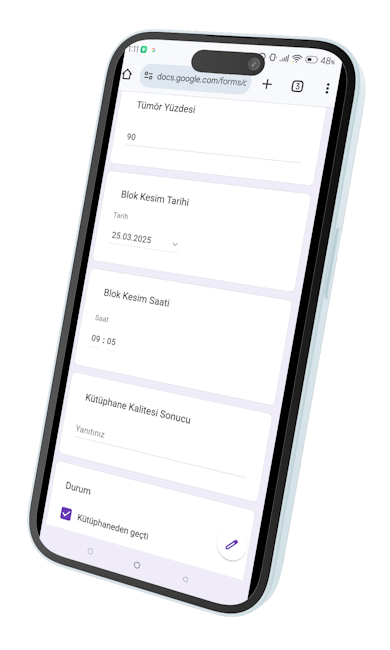

# 📁 Google Form ile Dinamik Hasta Takip Tablosu

## 🧩 Bu Nedir?

Bu proje sayesinde, **Google Form** üzerinden hasta bilgilerini toplayabilir ve **Google E-Tablolar (Sheets)** üzerinde otomatik olarak eşleşen, güncellenen ve genişleyebilen bir "veri tabanı görünümü" elde edebilirsiniz.

Kodlar tamamen **Google Apps Script** ile hazırlanmıştır.  
**Formda protokol numarası (`MP42/25` gibi)** esas alınır ve bilgilerin tekrarsız, güncel hali "Veri" adlı sayfaya formüllerle yansıtılır. Veri içermeyen cevaplar eskileri silmez.

---

## 🛠️ Gerekli Dosyalar

Projeye başlamadan önce bu dosyaların elinizde olması gerekir:

- `doldurVeriSayfasi_0_500.gs` → İlk 500 satır için formül yerleşimi  
- `doldurVeriSayfasi_501_1000.gs` → 501–1000 arası satırlar için genişletme

---

## 🚀 Kurulum Adımları

### 1. 📄 Google Form Oluşturun
Google Form'unuza şu alanları mutlaka ekleyin:

- ✅ **Zaman damgası** (otomatik eklenir)
- ✅ **E-posta adresi** (opsiyonel ama önerilir)
- ✅ **Hasta Protokol Numarası** (örneğin: `MP42/25`)

🔒 **Protokol Numarası alanı için doğrulama:**  
Yanıt doğrulaması: `Normal ifade içerir` → `^[^\s]+$`  
Açıklama: `"Boşluk içermeyen bir kod girin (örn: MP42/25)"`

---

### 2. 📊 Google Sheets’e Bağlayın
Form yanıtlarını yeni bir Google E-Tabloya gönderin:

- Form ayarlarından **“Yanıtlar” > “Elektronik tabloya gönder”** seçin.
- Yeni bir e-tablo oluşturun.

---

### 3. 📑 “Veri” Sayfası Ekleyin

Oluşan e-tabloda, alt kısmında yeni bir sayfa (sheet) ekleyin.  
Bu sayfanın adını tam olarak **`Veri`** yapın. (Büyük/küçük harf önemli.)

---

### 4. 💻 Apps Script’i Açın

Google Sheets’te:

- Menüden **Uzantılar → Apps Komut Dosyası**'nı açın.
- Açılan editörde:

  - `doldurVeriSayfasi_0_500.gs` dosyasındaki kodu yeni bir `.gs` dosyasına yapıştırın.
  - Aynı şekilde, 500’den fazla hasta için gerekiyorsa `doldurVeriSayfasi_501_1000.gs` dosyasını da ekleyin.

---

### 5. ▶️ Script’i Çalıştırın

- Editörde üstteki listeden `doldurVeriSayfasi_0_500()` fonksiyonunu seçin ve ▶️ butonuna tıklayın.
- Google sizden izin isteyecek, “Gelişmiş”e tıklayıp izni verin.

✅ Artık **Veri** sayfasında ilk 500 satıra otomatik olarak formüller yerleşecek.  
Yeni hasta girişiyle yeni satır eklenir.  
Aynı hasta tekrar girilirse, son bilgiler otomatik yansıtılır.

---

## 🔁 Genişletme (501–1000 Satır)

Eğer hasta sayınız 500'den fazlaysa:

- `doldurVeriSayfasi_501_1000` fonksiyonunu çalıştırın.
- Böylece 501–1000 arası satırlar da formülle doldurulmuş olur.
- Form sayısı yüz binler olabilir sorun değil.
---

## 🧠 Neler Bilmelisiniz?

- Google Form’da yaptığınız eklemeler (soru ekleme gibi), **Veri** sayfasında da başlıkları eklemenz gerekebilir.
- Her form yanıtı geldiğinde formüller otomatik çalışır.
- Elle formül yazmanıza gerek yoktur.
- İlk hastanız formdan gönderilince ilk satırda belirir. İkinci hasta ikinci satıra geçer.
- girilmiş bir hasta tekrar girilince yeni satır eklenmez, eskisinin üserine yeni bilge neyse eklenir, boş yanıtlar dolu hücreleri boş yapmaz.

---

## 🔓 Lisans

Bu proje [MIT Lisansı](LICENSE) ile sunulmuştur.  
Klinik, eğitimsel veya araştırma amaçlı dilediğiniz gibi kullanabilir ve geliştirebilirsiniz.

---

## 💬 Geri Bildirim

İlk kez kullananlar için adım adım anlatım hedeflenmiştir.  
Sizden gelen katkı ve önerilerle proje gelişmeye devam edecek.

🔗 [GitHub Repo](https://github.com/metinciris/Google-Form-Hasta-Takip)

